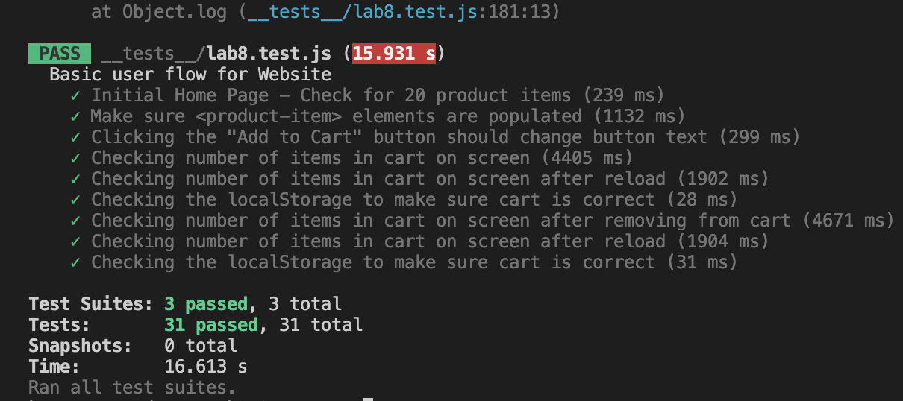

# Lab 8 - Starter
>1) Where would you fit your automated tests in your Recipe project development pipeline? Select one of the following and explain why.
> - 1.Within a Github action that runs whenever code is pushed 
> The code will be checked whenever I think it's done, and I can also keep track of the change the modifcation I made for later reference.

> 2) Would you use an end to end test to check if a function is returning the correct output? (yes/no)
> - no

> 3) Would you use a unit test to test the “message” feature of a messaging application? Why or why not? For this question, assume the “message” feature allows a user to write and send a message to another user. 
> - No. Since message is not fixed. Unit test is good for testing function, which has specfied input and output.

> 4) Would you use a unit test to test the “max message length” feature of a messaging application? Why or why not? For this question, assume the “max message length” feature prevents the user from typing more than 80 characters.
> - Yes, it should be a function that will dectect the length of message. And we can use te unit test to see what will the function behave when the message exceeds the limit and when it doesn't.

# Screenshots

